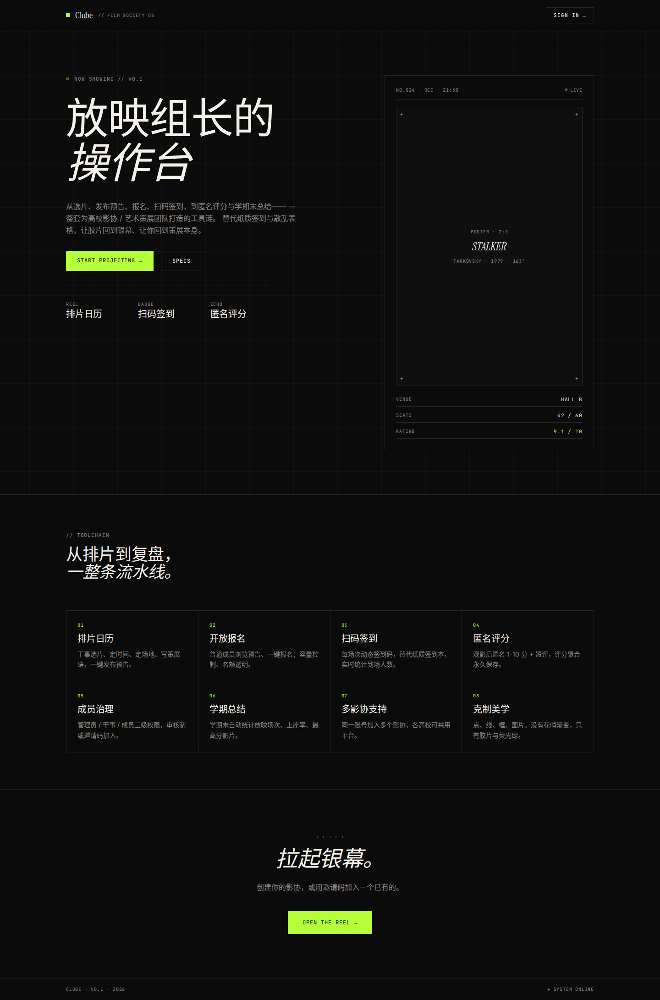
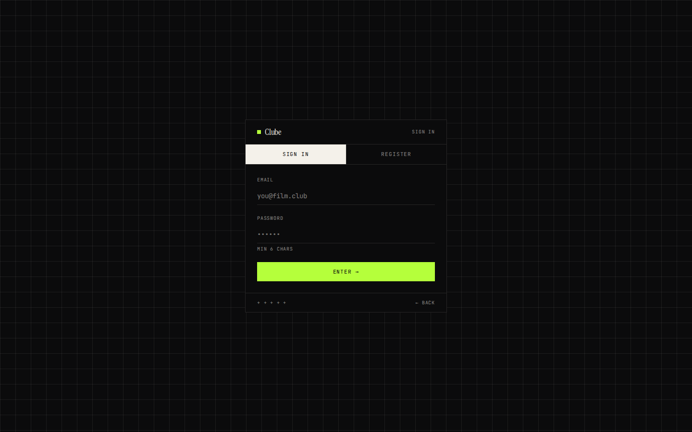
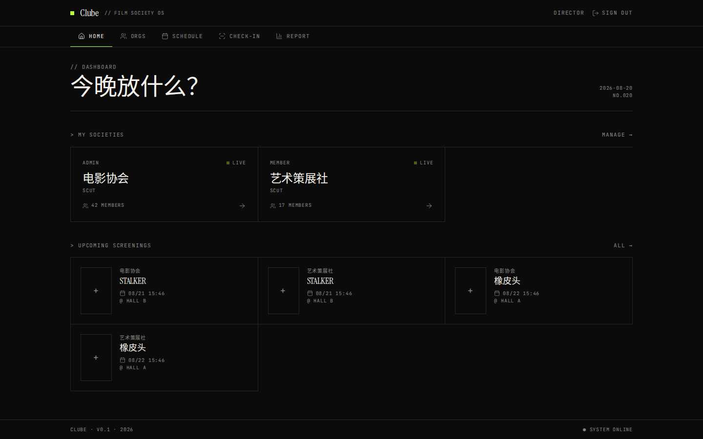
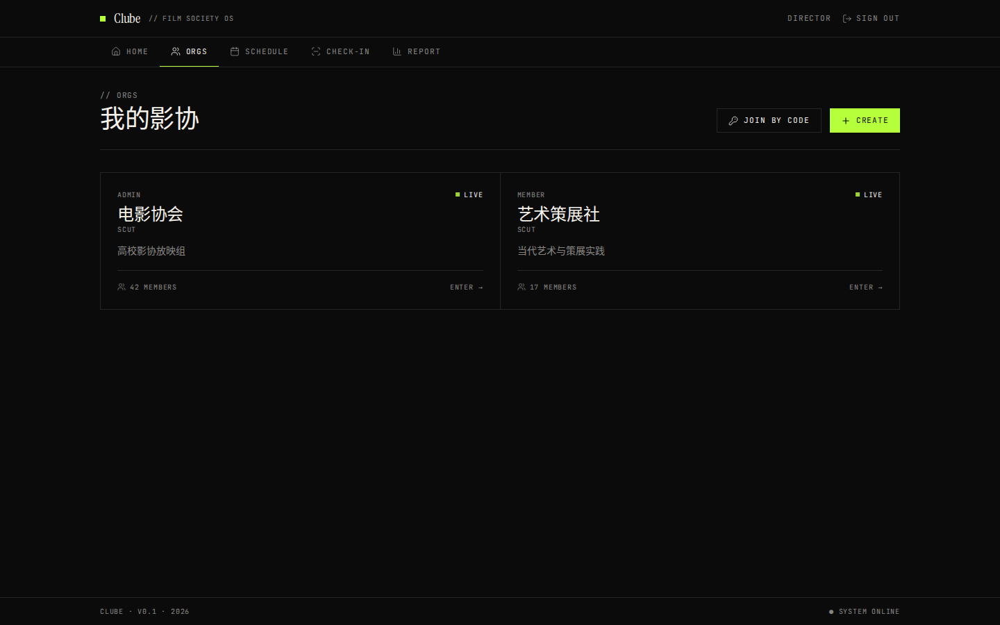
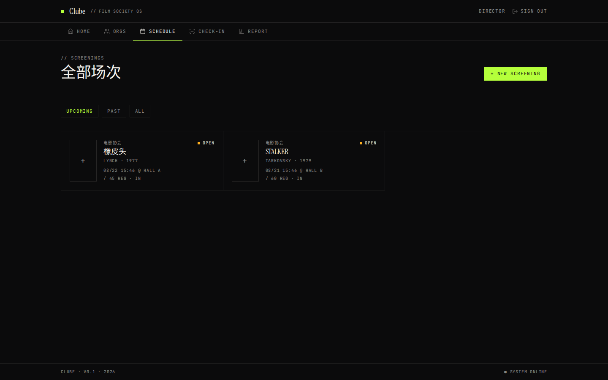

# Clube · 影协放映助手

一站式覆盖高校影协「排片 → 报名 → 签到 → 评分 → 复盘」的极客风管理工具。

## 功能

- **组织管理**：创建/加入影协（邀请码 / 审批 / 开放加入），admin / officer / member 三级角色
- **排片**：新建场次，填电影信息、地点、时间、容量、curator note，生成 6 位签到码 + QR 码
- **签到**：成员扫码或输码签到；干事端内置摄像头扫码工具（jsqr）
- **匿名评分**：每人每场一次 1-10 分 + 短评（user_id 仅去重，永不外显）
- **学期总结**：自动生成复盘报告（场次统计 / 评分分布 / 上座率）

## 技术栈

- Next.js 16 (App Router) + React 19 + TypeScript 5
- Tailwind CSS 4 + shadcn/ui（自绘极简元件）
- Supabase Auth + Supabase Postgres（服务端用 Service Role Key，浏览器端用 anon key + RLS）
- Drizzle ORM（schema 定义在 `src/storage/database/shared/schema.ts`）
- QR：`qrcode.react`（生成）+ `jsqr`（扫描）

## 界面预览

| 落地页 | 登录 | 仪表盘 |
| --- | --- | --- |
|  |  |  |

| 我的影协 | 排片表 |
| --- | --- |
|  |  |

## 快速开始

### 0. 准备 Supabase

1. 在 [supabase.com](https://supabase.com) 创建项目
2. 复制 `src/storage/database/shared/schema.ts` 中的表结构到 Supabase SQL Editor 执行（或用 drizzle-kit push）
3. 在项目 Settings → API 获取 URL / anon key / service_role key

### 1. 安装依赖

```bash
pnpm install   # 必须用 pnpm（preinstall 已强制）
```

### 2. 配置环境变量

```bash
cp .env.example .env
# 填入 SUPABASE_URL / SUPABASE_ANON_KEY / SUPABASE_SERVICE_ROLE_KEY
```

### 3. 开发

```bash
pnpm dev       # http://localhost:5000
```

### 4. 构建 & 启动生产

```bash
pnpm build
pnpm start     # 默认 0.0.0.0:5000，可用 PORT/HOSTNAME 覆盖
```

## 服务器部署

标准 Node.js 部署（任意 VPS / 云服务器 / Docker）：

```bash
# 1. 服务器上
git clone https://github.com/NoahIsARider/Clube.git
cd Clube
pnpm install
cp .env.example .env && vim .env   # 填环境变量
pnpm build
pnpm start                          # 生产服务
```

推荐用 pm2 守护：

```bash
npm i -g pm2
pm2 start "pnpm start" --name clube
pm2 save
```

或配 systemd 单元。反向代理（nginx/caddy）将 80/443 转发到 5000 即可。

### Docker 部署

```bash
docker build -t clube .
docker run -d -p 5000:5000 --env-file .env clube
```

## API 一览

所有需登录接口通过 `x-session` 头（Supabase access token）鉴权，前端用 `authedFetch()` 自动携带。

| 路径 | 方法 | 说明 |
| --- | --- | --- |
| `/api/supabase-config` | GET | 公开：返回 supabase url/anonKey（安全，RLS 保护） |
| `/api/me` | GET | 当前用户资料 |
| `/api/orgs` | GET/POST | 我的组织列表 / 创建 |
| `/api/orgs/[id]` | GET/PATCH/DELETE | 详情 / 修改 / 解散（admin） |
| `/api/orgs/[id]/members` | GET/POST | 成员列表 / 申请加入 |
| `/api/orgs/[id]/members/[memberId]` | PATCH/DELETE | 审核 / 改角色 / 踢人 |
| `/api/orgs/[id]/invites` | GET/POST | 邀请码列表 / 生成 |
| `/api/orgs/join` | POST | 通过邀请码加入 |
| `/api/orgs/[id]/screenings` | GET/POST | 场次列表 / 新建 |
| `/api/orgs/[id]/report` | GET | 学期末总结 |
| `/api/screenings/[id]` | GET/PATCH/DELETE | 场次详情 / 修改 / 删除 |
| `/api/screenings/[id]/signup` | POST/DELETE | 报名 / 取消 |
| `/api/screenings/[id]/checkin` | POST | 签到（code，兼容 QR） |
| `/api/screenings/[id]/ratings` | POST | 匿名评分 + 短评 |

## 项目结构

```
src/
├─ app/
│  ├─ page.tsx                        # 登录态路由跳转
│  ├─ login/page.tsx                  # 登录/注册（邮箱+密码）
│  ├─ app/                            # 需登录主 App（AppShell 包裹）
│  │  ├─ page.tsx                     # Dashboard
│  │  ├─ orgs/                        # 我的影协
│  │  ├─ screenings/                  # 场次 / 新建 / 详情 / 扫码签到
│  │  └─ ...                          # 学期总结 report 等
│  └─ api/                            # 后端接口
├─ components/                        # app-shell / geek-ui / ui(shadcn)
├─ lib/                               # api-auth / authed-fetch / org-permission / supabase
└─ storage/database/
   ├─ supabase-client.ts              # 服务端 supabase 单例（.env 加载）
   └─ shared/schema.ts                # Drizzle Schema（Postgres）
```

## 常用命令

```bash
pnpm dev            # 开发
pnpm build          # 生产构建
pnpm start          # 生产启动
pnpm ts-check       # TypeScript 检查
pnpm lint           # ESLint
pnpm validate       # ts-check + lint 并行
```

## 设计语言

极客美学：黑底磷绿 + 衬线大字 + 等宽 caption + 1px 网格线，见 `DESIGN.md`。
